```{r, include = FALSE}
knitr::opts_chunk$set(
  fig.width = 6,
  fig.height = 4,
  out.width = "100%",
  fig.align = "center",
  dev.args = list(bg = 'transparent'),
  fig.retina = 3,
  echo = FALSE,
  warning = FALSE,
  message = FALSE,
  cache = FALSE,
  cache.path = "cache/"
)
if(!require(emoji))
  install.packages("emoji")
library(emoji)
```


## <br>[`r rmarkdown::metadata$pagetitle`]{.monash-blue} {#etc5523-title background-image="images/bg-01.png"}

### `r rmarkdown::metadata$subtitle`

Lecturer: *`r rmarkdown::metadata$author`*

`r rmarkdown::metadata$department`

::: tl
<br>

<ul class="fa-ul">

<li><i class="fas fa-envelope"></i>`r rmarkdown::metadata$email`</li>

<li><i class="fas fa-calendar-alt"></i>
`r rmarkdown::metadata$date`</li>

<li><i class="fas fa-globe"></i>
`r rmarkdown::metadata[["unit-url"]]`</li>

</ul>

<br>
:::

<!-- --- -->
<!-- class: transition -->

# This is a case study using the US airlines database {background-color="#006DAE"}


<!-- --- -->
## Motivation

American Statistical Association Statistical Graphics and Computing Sections [2009 Data Expo](https://community.amstat.org/jointscsg-section/dataexpo/dataexpo2009) provided all of the commercial flight records for air travel in the USA from October 1987 to April 2008. 

<center>
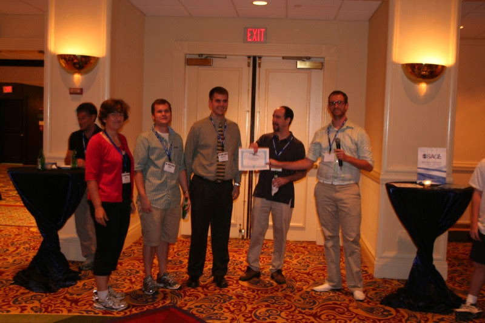
</center>
  
<!-- --- -->
# Questions provided

:::{.incremental}

- When is the best time of day/day of week/time of year to fly to minimise delays?
- Do older planes suffer more delays?
- How does the number of people flying between different locations change over time?
- How well does weather predict plane delays?
- Can you detect cascading failures as delays in one airport create delays in others? Are there critical links in the system?

<br>
<br>
<br>

- but participants could also decide for themselves what to analyse.

:::

[Remember: Start with a question]{.h3}

<!-- --- -->

## About the data

::::{.columns}

:::{.column width=50%}

* nearly 120 million records
* 12Gb of space uncompressed
* 1.6Gb compressed


Organisers provided instructions on how to set up an [**sqlite database**]{.monash-orange2}, and access from R.

:::

:::{.column width=50%}

Read about [accessing databases from R]{.monash-blue} at this [RStudio site](https://db.rstudio.com/databases/sqlite/) is a good starting place to read about working with a sqlite database.

:::

::::


<!-- --- -->
## The original data source

::::{.columns}

:::{.column width=50%}


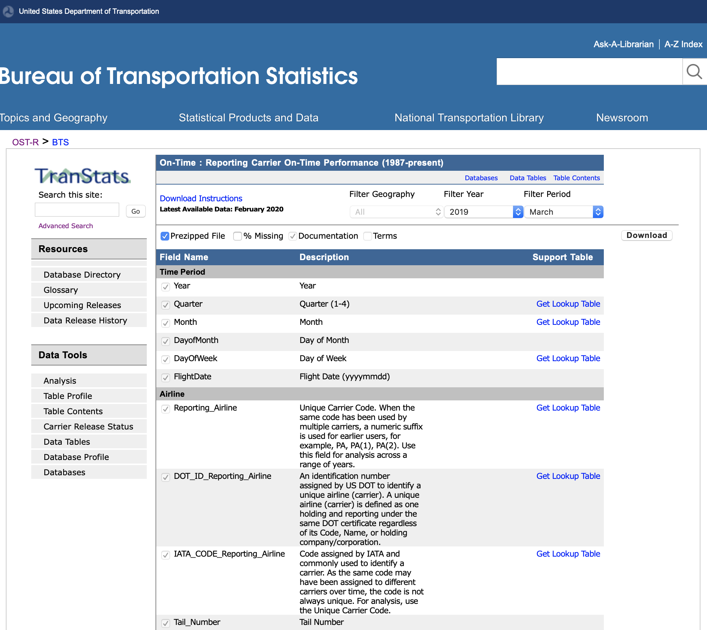

:::

:::{.column width=50%}

* You can find the most current data [here](
 https://www.transtats.bts.gov/DataIndex.asp)
* Look at the
 "On-Time Performance 1987-present" table.
 
* You can download data a month at a time
* There is a lag in records appearing on the site, currently of several months
* Data dictionary/explanations the variables
* Links at bottom of the site tells you what web site collects on you when you visit (Privacy Policy), but there is no clear license or policy on usage. 

:::

::::

<!-- --- -->
#### Accessing the data

- Data expo files: the data for the competition is still available because it was given a DOI: [https://doi.org/10.7910/DVN/HG7NV7](https://doi.org/10.7910/DVN/HG7NV7). `r emoji("cartwheel")`
- Navigating the [BTS web interface](https://www.transtats.bts.gov/DataIndex.asp)
    - What data is available
    - How do you download
    - Explanations of the records and variables
- R package `nycflights13`: provides a small domesticated data set.`r emoji("koala")` This is a good way to *dip your toes in the water* with the airline data - try this as a start before working with the full data.

```{r}
#| echo: true
#| eval: false

library(nycflights13) #<<
data(airlines)
data(airports)
data(flights)
data(planes)
data(weather)
```

<!-- --- -->
<!-- class: transition -->

# What does the data look like? {background-color="#006DAE"}

## {.smaller}

<!-- .scroll-box-16[ -->
```{r}
#| echo: true
#| eval: true
library(tidyverse)
# Careful with file name here - and this dataset should only contain Jan 2020 data
flights_jan2020 <-
  read_csv(here::here("data/T_ONTIME_REPORTING.csv"))
flights_jan2020 |>
  select(FL_DATE, OP_UNIQUE_CARRIER, TAIL_NUM, ORIGIN, DEST, DEP_TIME, ARR_TIME, ARR_DELAY) |>
  slice_head(n=10)
```

<!-- ] -->

- What's in a row?
- What type of data collection is this? (e.g. experimental or observational? Census, survey sampling or occurrence?) 

<!-- --- -->
# How would you start to process the data to answer ...

:::{.incremental}
- When is the best time of day/day of week/time of year to fly to minimise delays?
- Are some carriers operating more efficiently?
- Do some carriers operate more broadly than others?
- Do older planes suffer more delays?
:::

<!-- --- -->
<!-- class: transition -->

# What did the prize winners do? {background-color="#006DAE"}

<!-- --- -->
<!-- class: motivator -->
## First prize `r emoji("trophy")` [^1]

<center>
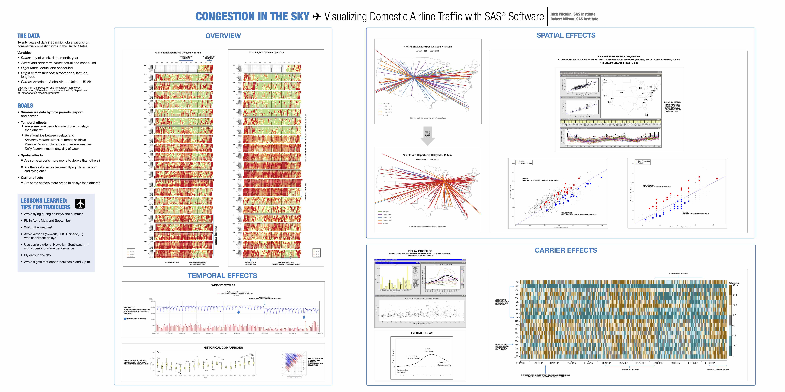
</center>

[^1]: Rick Wicklin, Robert Allison


<!-- --- -->
<!-- layout: true -->
<!-- class: shuriken-300 white -->

<!-- .blade1.bg-red.content.center[ -->
# Overview {background-color="#006DAE"}

## 

Its good practice to show a useful view of entire data, to get a rough sense of major patterns.

### Temporal trend

A major component of this data is traffic patterns over time.

### Spatial pattern

Airports are distributed across the country, explore how the traffic operates relative to this geography.

### Carriers

Are some carriers operating more widely, or more efficiently?

<!-- ]] -->
<!-- .hole.bg-black[.content.center.vmiddle[ -->

<!-- ]] -->
<!-- --- -->

<!-- class: hide-blade2 hide-blade3 hide-blade4 hide-hole -->

<!-- --- -->

<!-- class: hide-blade3 hide-blade4 hide-hole -->
<!-- count: false -->

<!-- --- -->

<!-- class: hide-blade4 hide-hole -->
<!-- count: false -->

<!-- --- -->
<!-- count: false -->

# Highlights {background-color="#006DAE"}

<!-- --- -->
<!-- layout: false -->

<!-- .flex[
.w-25[ -->
# Overview
<!-- ] -->
<!-- .w-70[ -->
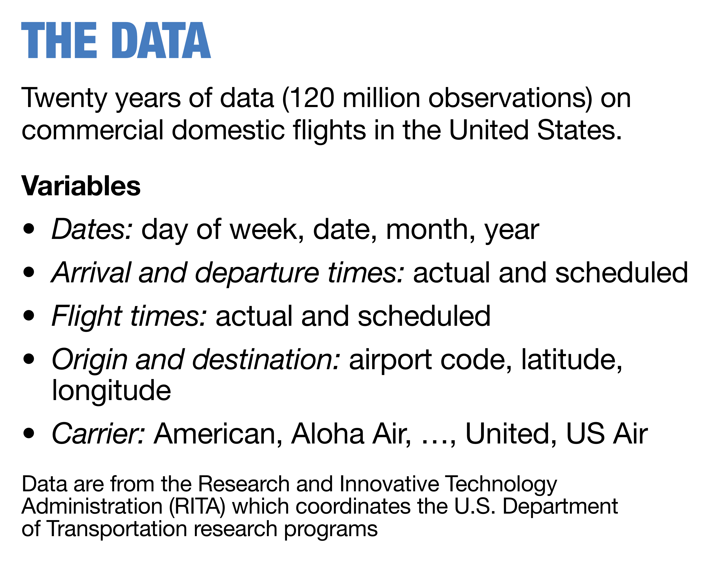
<!-- ] -->
<!-- ] -->

<!-- --- -->
<!-- .flex[ -->
<!-- .w-25[ -->
# Overview
<!-- ] -->
<!-- .w-70[ -->
  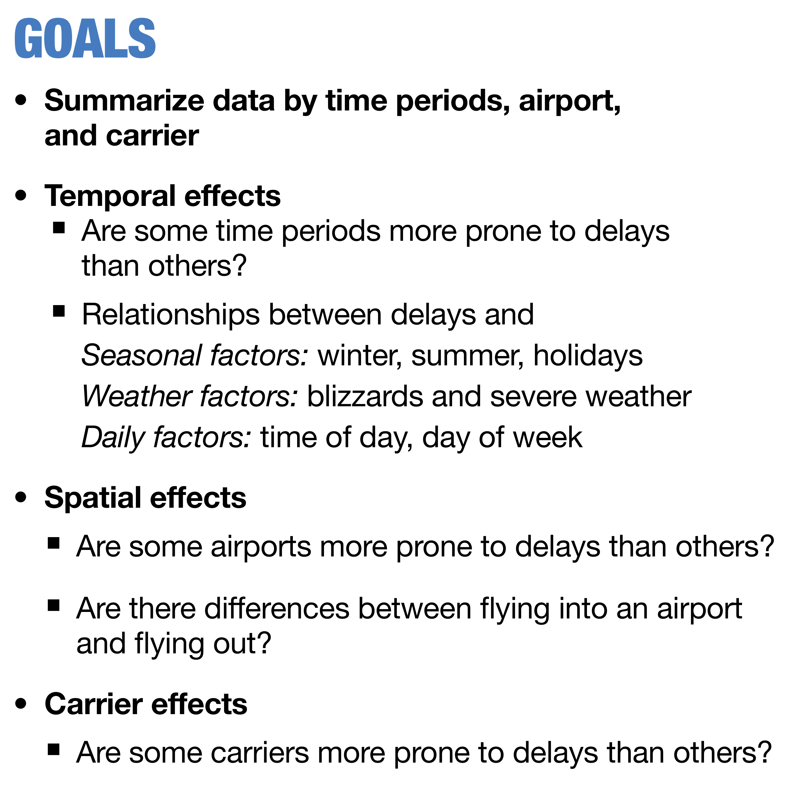
<!-- ] -->
<!-- ] -->
<!-- --- -->
<!-- .flex[ -->
<!-- .w-25[ -->

# Overview
<!-- ] -->
<!-- .w-70.scroll-box-32[ -->
  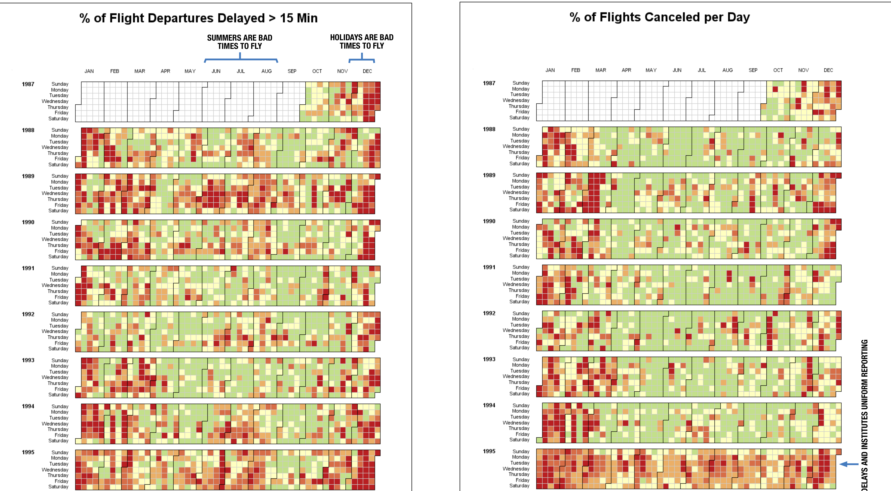
<!-- ] -->
<!-- ] -->
<!-- --- -->
<!-- class: middle center -->

<!-- .think-box[ -->
## Think about it `r emoji("thinking")`

:::{.callout-note}
[Delay]{.monash-orange2} was used in providing an overview.

- What other aggregates could have been used?
- Why was delay chosen?
:::
<!-- ] -->

<!-- --- -->

# Temporal  trend

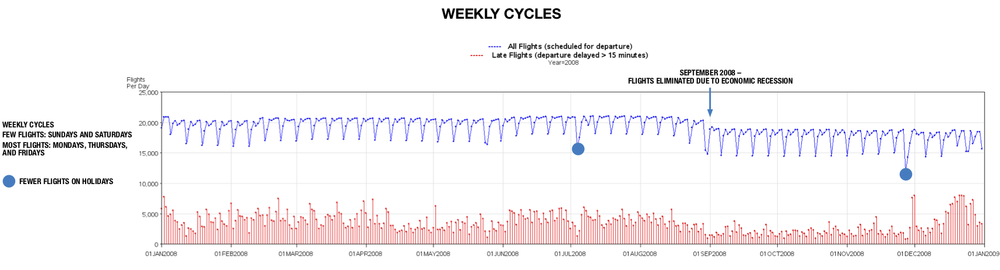

<!-- --- -->

# Temporal  trend

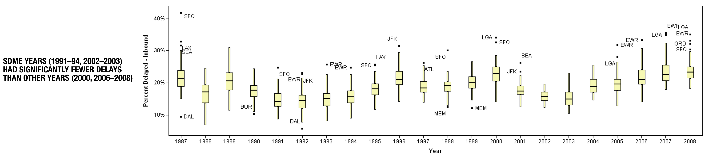

<!-- --- -->
<!-- .flex[ -->
<!-- .w-25[ -->
# Spatial
<!-- ] -->
<!-- .w-70[ -->

<!-- .scroll-box-32[ -->
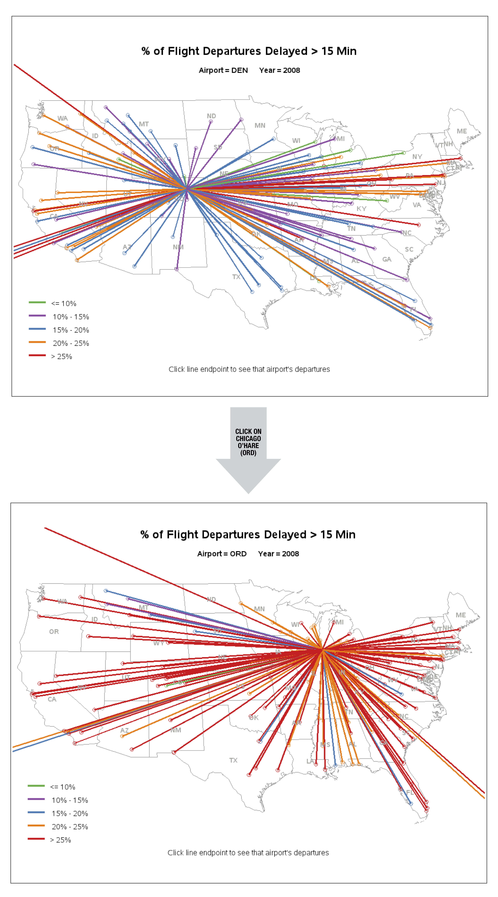
<!-- ] -->
<!-- ] -->
<!-- ] -->
<!-- --- -->

# Carrier

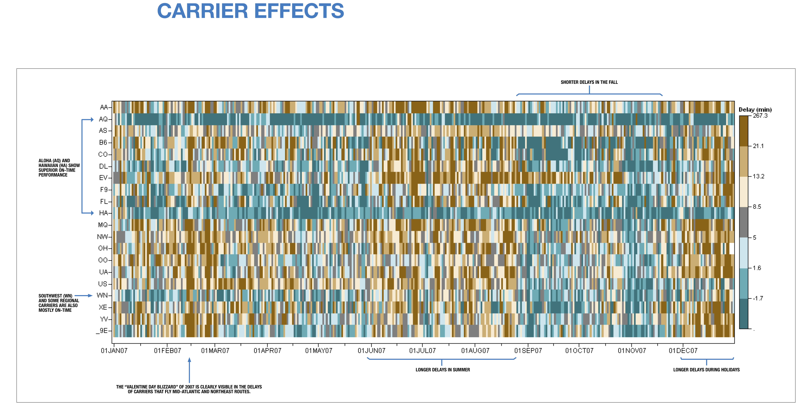

<!-- --- -->
<!-- .flex[ -->
<!-- .w-25[ -->

# Highlights
<!-- ] -->
<!-- .w-70[ -->

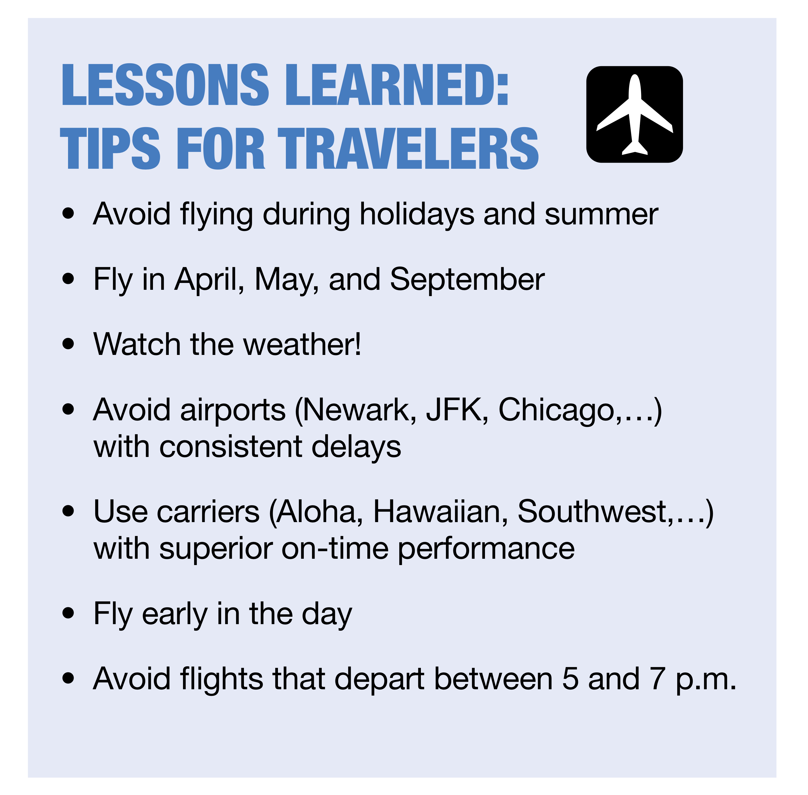
<!-- ] -->
<!-- ] -->

<!-- --- -->
<!-- class: motivator -->
## Second prize `r set.seed(5);emoji("medal")`[^2]

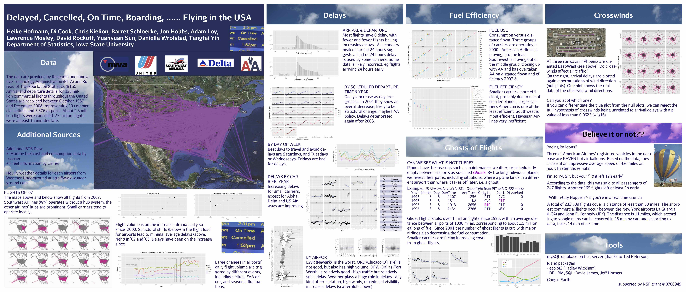

[^2]: [Hofmann, Cook, Kielion, Schloerke, Hobbs, Loy, Mosley, Rockoff, Sun, Wrolstad, Yin](https://amstat.tandfonline.com/doi/abs/10.1198/jcgs.2011.3de#.XsbqbS97G61)

<!-- --- -->
<!-- .flex[ -->
<!-- .w-45[ -->
## Analysis overview {.smaller}

::::{.columns}

:::{.column width=50%}

- Overview: flight paths over country
- Analysis:
    - Traffic patterns over time, including 911, and strikes, bankruptcies
    - Delays over time, and by day, hour
    - Airport efficiency
    - Carrier efficiency
    - Ghost flights: what's a ghost flight?
    - Mapping traffic spatially, and animating
- Curious findings

:::
<!-- ] -->
<!-- .w-45[ -->

:::{.column width=50%}

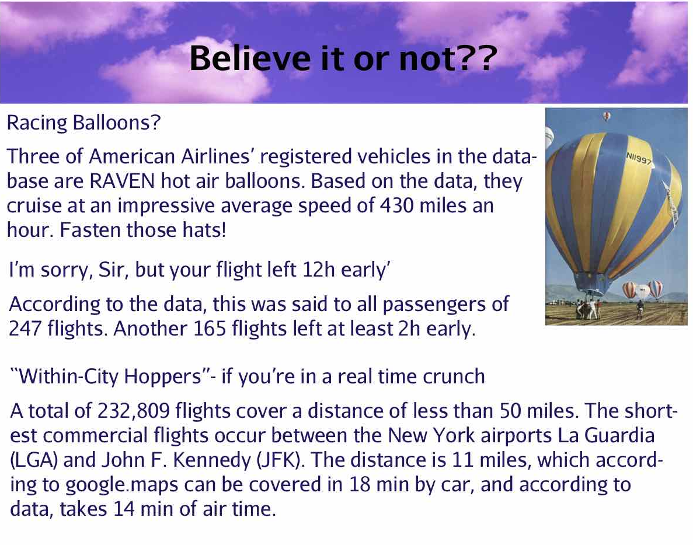

:::

::::

<!-- ] -->
<!-- ] -->

<!-- --- -->
<!-- class: middle  -->

<!-- .think-box[ -->
## As we work through the summary plots, think about 

:::{.callout-note}

- what needs to be done to the data to get to this summary
- what do you learn from each display, what's expected, what's surprising
- what other ways might the same information be presented, or other calculations made

:::

<!-- ] -->
<!-- --- -->
# Traffic patterns over time{.smaller}

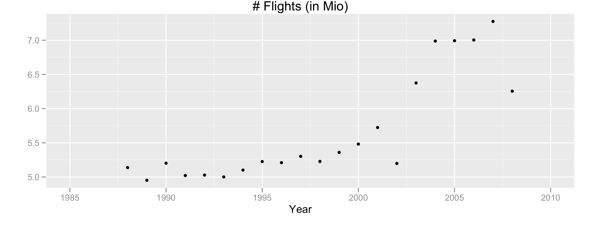

Number of flights in millions per year: steadily increasing volume until 2001, with a big drop in 2002. Volume recovered in 2003, and flattens 2004-7, with another drop in 2008. What happened in 2001? What was happening in 2008?

<!-- --- -->
# Traffic patterns at selected airports

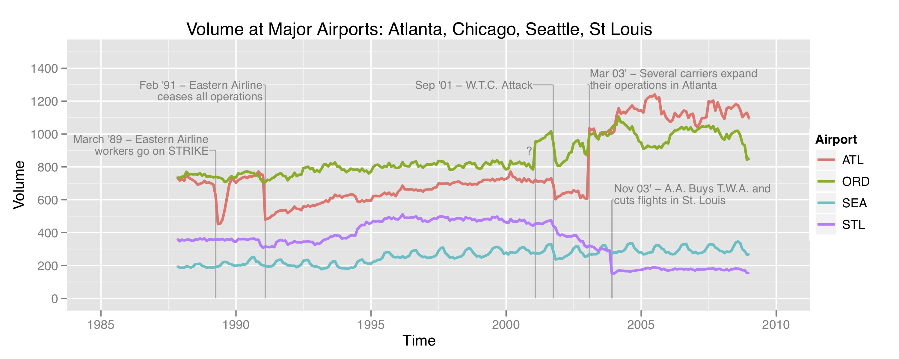

<!-- --- -->
<!-- .flex[ -->
<!-- .w-25[ -->
# Delays
<!-- ] -->
<!-- .w-70[ -->
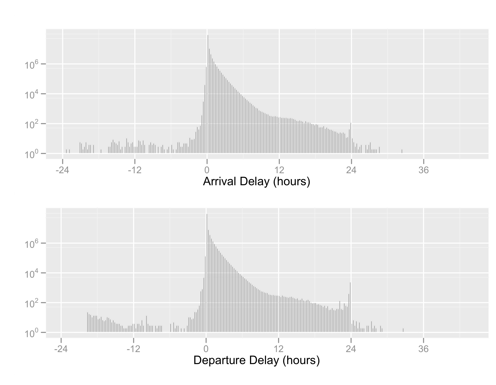
<!-- ]] -->
<!-- --- -->
<!-- .flex[ -->
<!-- .w-25[ -->

# Delays, by year
<!-- ] -->
<!-- .w-70[ -->

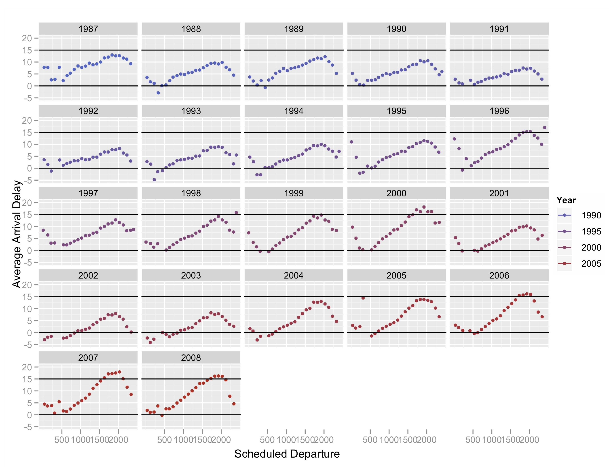
<!-- ]] -->

<!-- --- -->
<!-- .flex[ -->
<!-- .w-15[ -->
# Delays, by carrier
<!-- ] -->
<!-- .w-80[ -->
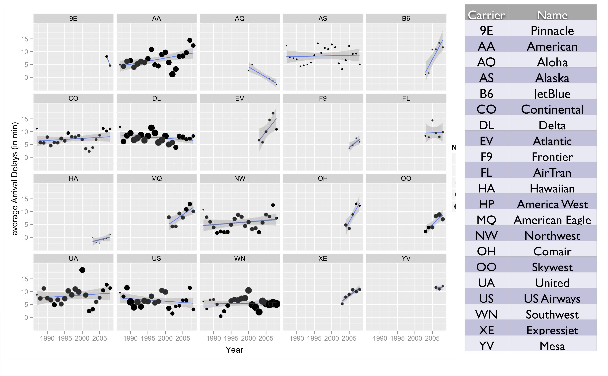
<!-- ]] -->

<!-- --- -->
<!-- .flex[ -->
<!-- .w-25[ -->
# Delays, by airport
<!-- ] -->
<!-- .w-70[ -->

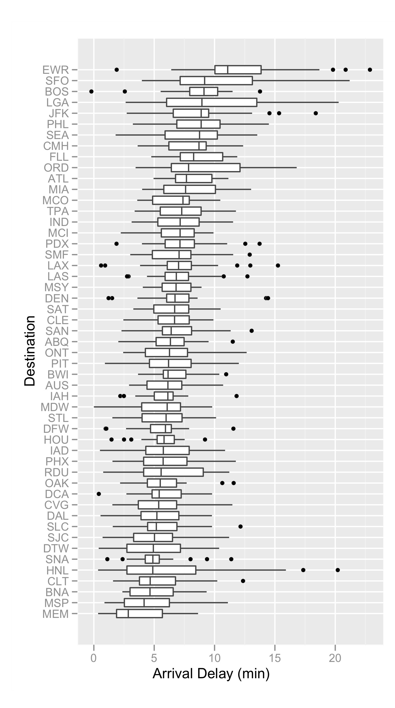
<!-- ] -->
<!-- ] -->
<!-- --- -->

# Delays, by day

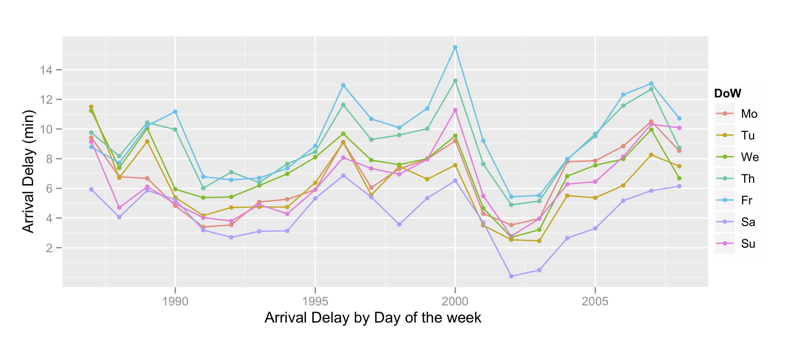

<!-- --- -->
<!-- .flex[ -->
<!-- .w-15[ -->
# Fuel use by carrier
<!-- ] -->
<!-- .w-80[ -->

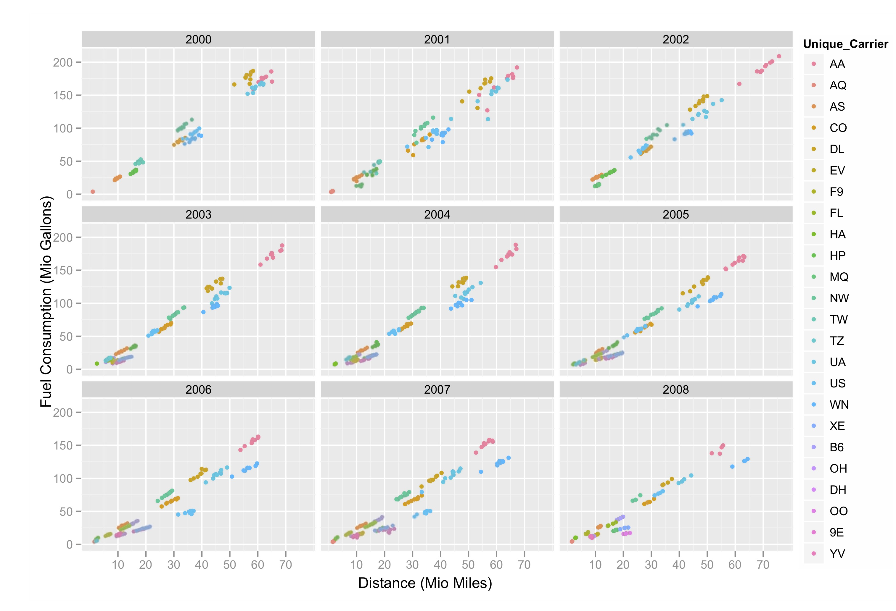
<!-- ]] -->
<!-- --- -->
<!-- .flex[ -->
<!-- .w-15[ -->

# Fuel efficiency
<!-- ] -->
<!-- .w-80[ -->

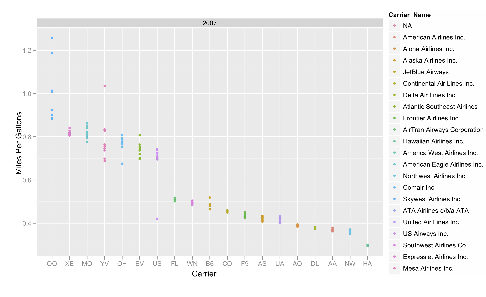
<!-- ]] -->

<!-- --- -->
# Ghost flights

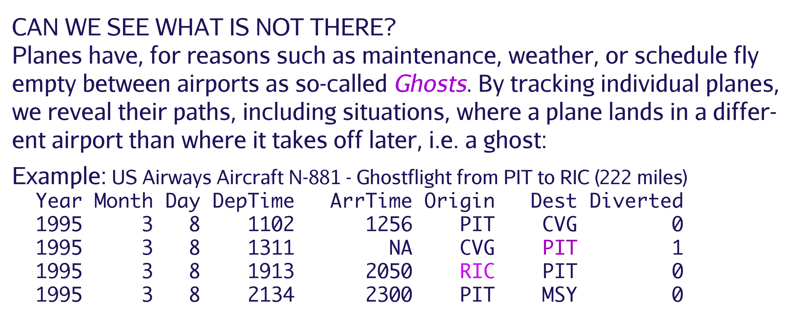

<!-- --- -->
<!-- .flex[ -->
<!-- .w-15[ -->
# Ghost flights, wasted fuel
<!-- ] -->
<!-- .w-80[ -->


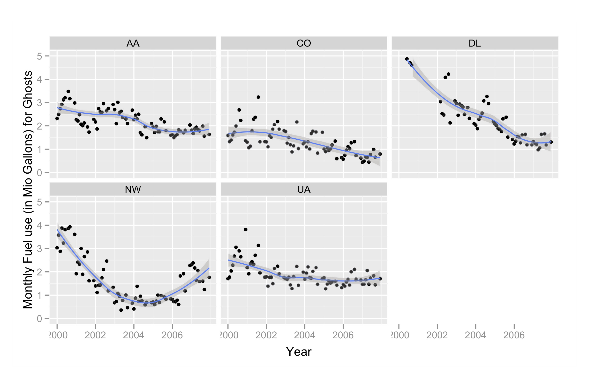
<!-- ] -->
<!-- ] -->
<!-- --- -->

# What tools were used and why

A subset of the analysis materials including data and code can be downloaded from the [paper site](https://amstat.tandfonline.com/doi/suppl/10.1198/jcgs.2011.3de?scroll=top)

- sqlite database: Inspired by the guidelines provided by the organisers we created a `mysql` database, on a central server that all team members could access with a password. Each person accessed the data through R.
- R packages: `RMySQL`, `DBI`, `ggplot2`

<!-- TODO: Removed database stuff from here -->

# Summary {background-color="#006DAE"}

<!-- --- -->
<!-- background-image: url(images/wild_vs_domesticated3.jpeg) -->
<!-- background-size: 70% -->
<!-- background-position: 50% 100% -->
<!-- class: hide-slide-number -->

<!-- .fill-box[ -->
# Working with wild data can be daunting!{.smaller}

1. Start with questions that might be answered using the data.
2. Map out a pipeline to process the data, to address the question.
3. Think about what might be expected, so results can be "externally validated".

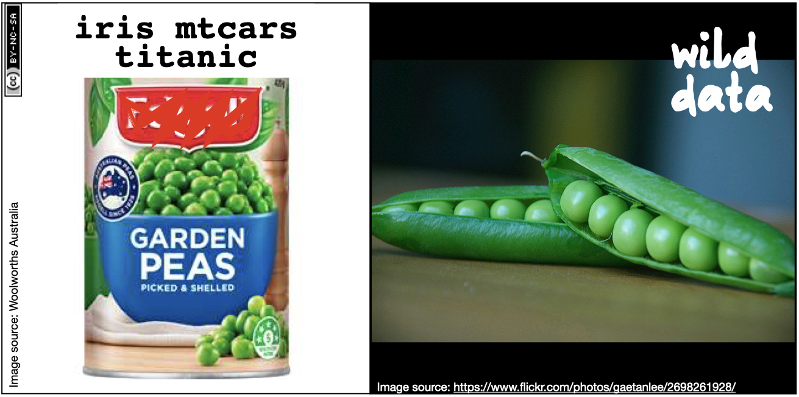

<!-- ] -->

<!-- --- -->

<!-- --- -->

